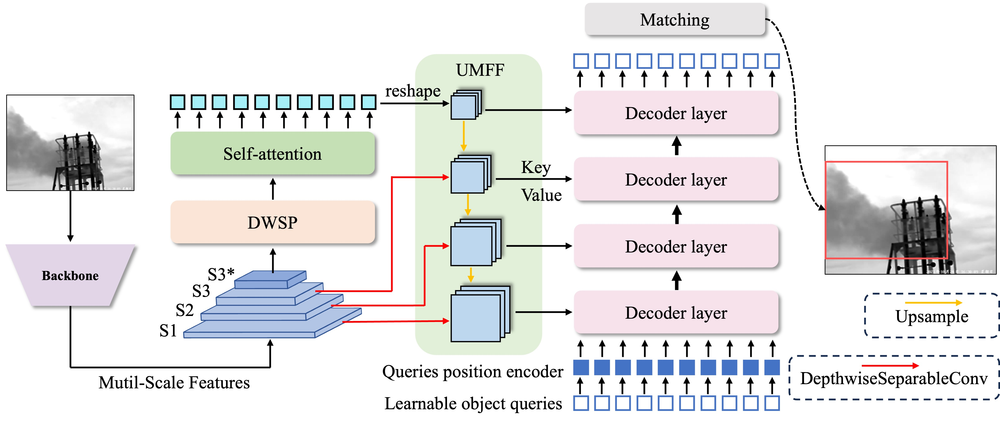
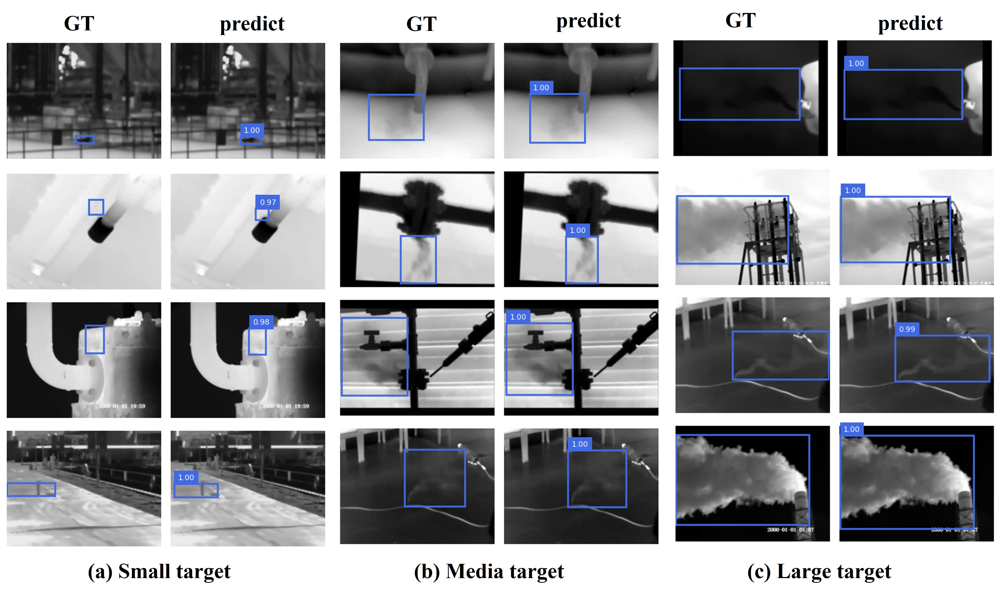
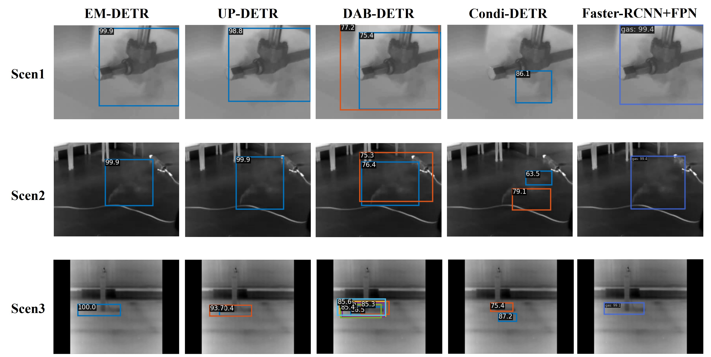

**EM-DETR**: Efficient Multi-scale DETR for Gas Leak Detection Based on Infrared Imaging
========

we propose an efficient and high-performance end-to-end object detection network,the [**Efficient Multi-scale Detection Transformer**] **(EM-DETR)**, for automatic gas leak detection. The main contributions of this paper are as follows:

1. For the first time, a simple and unified end-to-end object detection model is applied to the field of automatic detection of gas leak infrared images.
2. The forward and reverse multi-scale features fusion method improves the detection performance of gases in different leakage ranges at a small computational cost.
3. The proposed EM-DETR outperforms the previous methods in gas leak detection and has minimal computational cost and parameters, making it easy to deploy.

The overall structure of Efficient Multi-scale DETR (EM-DETR) consists of a pre-trained Resnet backbone, a DWSP efficient encoder, and a transformer decoder, as shown in fellow.   

# Visualization of Detection Results
The detection results of the EM-DETR model, show casing a range of gas leak scenarios, including valves, pipelines, gas towers, boilers, and gas cylinders.

# Comparison of detection results of EM-DETR and other models in three different scenarios.
- Scenario 1 represents large-scale valve leakage;
- Scenario 2 corresponds to medium-range pipeline leakage;
- Scenario 3 refers to small-scale gas cylinder leakage.
